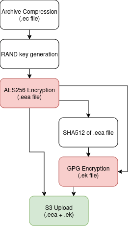

# Enigmafy
Enigmafy is a shell script which makes encrypting multiple archives an easy task. The script generates two files, ending in: .ek (enigmafy key) and .eea (enigmafy encrypted archive).

## How it works
Under the hood, Enigmafy first compacts the desired archive or folder in a single file, with the .ec extension. Then, symmetrically encrypts it (AES256-CBC) using a pseudo-aleatory password, transforming it on a .eea archive. This password is then asymmetrically encrypted using GnuPG, along with .eea file's SHA512 hash.



When decrypting, Enigmafy calculates SHA512 from the .eea file and only proceeds if it matches with the one stored on the .ek file.

## Recommendations
### GnuPG
- If you aren't familiar to GnuPG, please refer to [Linux Babe's guide](https://www.linuxbabe.com/security/a-practical-guide-to-gpg-part-1-generate-your-keypair).
- When creating an asymetrical key on GnuPG, prefer using Curve25519, or Curve448 if the file's content is classified (check out Soatok's blog [here](https://soatok.blog/2023/04/03/asymmetric-cryptographic-commitments/) and [here](https://soatok.blog/2022/05/19/guidance-for-choosing-an-elliptic-curve-signature-algorithm-in-2022/) to learn more about asymmetric encryption).

## Features
- AES-256 encrypted archives.
- Add a note to the encrypted archive, via **-n** option
- Upload archives to S3 services

## Installation
### 1. Clone the repository
```
git clone https://github.com/cibero42/enigmafy.git
```
### 2. Installation
The installation script requires root priviledges
```
cd enigmafy/
sudo ./install.sh
```

## Usage
### Encryption
To encrypt an archive called "your_archive" for gpg@key.org:
```
enigmafy -e gpg@key.org your_archive
```

It's also possible to set AES256 random password size, via **-k** option (the default is 64 characters):
```
enigmafy -e gpg@key.org -k 128 your_archive
```

You can send the encrypted archive to a S3 bucket using **-u**. Use it combined to **-c** in order to point to a non-AWS bucket.
```
enigmafy -e gpg@key.org -u your/bucket/path -c your-custom.s3.com your_archive
```

### Decryption
To decrypt an archive:
```
enigmafy -d your_archive.ek your_archive.eea
```

### Help
Run:
```
enigmafy -h
```

## FAQ
### What's up with the file extensions?
They exist since it's easier to type and you can "be sure" that these files are compatible this Enigmafy
- .ek (enigmafy key) -> .gpg file with the symmetrical password, hash, and other variables.
- .eea (enigmafy encrypted archive) -> .tag.gz.enc file which contains the actual payload.
- .ec (enigmafy compressed) -> .tar.gz temporary file which is exists as a transition state between original and encrypted version.